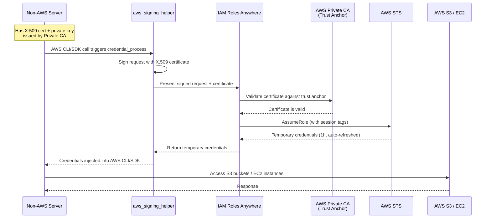
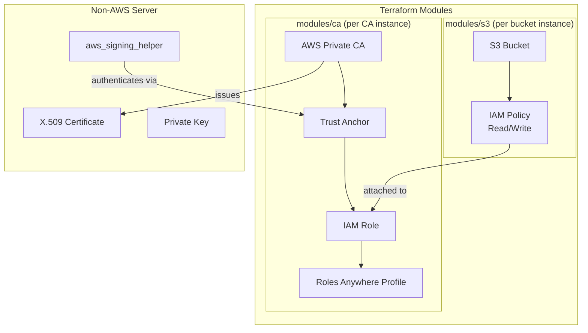

# OIDC Workload Identity for AWS

Enable non-AWS servers to securely access AWS resources (S3, EC2) using **IAM Roles Anywhere** with X.509 certificates issued by **AWS Private CA**. No long-lived access keys required.

## OIDC Workload Identity Flow



## Architecture



## Project Structure

```
oidc-workload-identity-aws/
├── main.tf                  # Root module — instantiates CA and S3 modules
├── variables.tf             # Root variables (cas map, s3_buckets map)
├── outputs.tf               # Aggregated outputs from all instances
├── providers.tf             # Terraform >= 1.9, AWS provider ~> 5.0
├── envs/                    # Environment-specific configurations
│   ├── dev.tfvars
│   ├── test.tfvars
│   └── prod.tfvars
├── modules/
│   ├── ca/                  # Private CA + trust anchor + IAM role + profile
│   │   ├── main.tf
│   │   ├── variables.tf
│   │   └── outputs.tf
│   └── s3/                  # S3 bucket + encryption + IAM policy
│       ├── main.tf
│       ├── variables.tf
│       └── outputs.tf
└── scripts/
    ├── setup-roles-anywhere.sh          # Post-apply server setup script
    └── configs/
        └── setup-roles-anywhere.conf.example  # Config template
```

## Prerequisites

- [Terraform](https://www.terraform.io/downloads) >= 1.9
- [AWS CLI](https://aws.amazon.com/cli/) v2
- AWS account with permissions for ACM PCA, IAM, Roles Anywhere, S3
- `openssl` on the target non-AWS server

## Terraform Usage

### 1. Configure your environment

Edit or create a tfvars file in `envs/`. Each environment defines a map of CAs and S3 buckets:

```hcl
# envs/dev.tfvars
aws_region = "eu-west-1"

tags = {
  Environment = "dev"
  ManagedBy   = "terraform"
}

cas = {
  "dev-ca" = {
    ca_common_name = "dev-root-ca"
    organization   = "MyOrg"
  }
}

s3_buckets = {
  "dev-data" = {
    bucket_name = "my-unique-dev-data-bucket"
    ca_key      = "dev-ca"    # links to the CA above
  }
}
```

Each CA instance creates a Private CA, trust anchor, IAM role, and Roles Anywhere profile. Each S3 bucket attaches a read/write IAM policy to the role of its linked CA.

### 2. Deploy

```bash
terraform init

# Create a workspace per environment (isolates state)
terraform workspace new dev

# Plan and apply
terraform plan  -var-file=envs/dev.tfvars
terraform apply -var-file=envs/dev.tfvars
```

### 3. View outputs

```bash
# All CA details (ARNs needed for server setup)
terraform output -json cas

# All S3 bucket details
terraform output -json s3_buckets

# Signing helper commands per CA
terraform output signing_helper_commands
```

## Post-Apply: Server Setup

Run this **once** on each non-AWS server that needs to access your AWS resources.

### 1. Copy the config template

```bash
cp scripts/configs/setup-roles-anywhere.conf.example scripts/configs/dev-ca.conf
```

### 2. Fill in the values from Terraform output

```bash
# Required values
CA_ARN="<from terraform output -json cas>"
TRUST_ANCHOR_ARN="<from terraform output -json cas>"
PROFILE_ARN="<from terraform output -json cas>"
ROLE_ARN="<from terraform output -json cas>"
AWS_REGION="eu-west-1"

# Optional overrides
# SERVER_CN="my-server"
# AWS_PROFILE_NAME="nonaws"
```

### 3. Run the setup script

```bash
./scripts/setup-roles-anywhere.sh scripts/configs/dev-ca.conf
```

The script will:
1. Generate a private key and CSR
2. Issue a certificate from your Private CA
3. Download the `aws_signing_helper` binary
4. Configure an AWS CLI profile with `credential_process`
5. Run a smoke test (`sts get-caller-identity`)

### 4. Verify

```bash
aws s3 ls s3://my-unique-dev-data-bucket --profile nonaws
```

## Environment Examples

| Environment | CAs | S3 Buckets | Usage |
|-------------|-----|------------|-------|
| dev         | 1   | 2          | `terraform apply -var-file=envs/dev.tfvars` |
| test        | 2   | 4          | `terraform apply -var-file=envs/test.tfvars` |
| prod        | 1   | 1          | `terraform apply -var-file=envs/prod.tfvars` |

## Cost

AWS Private CA costs **~$400/month per CA**. Plan your CA count accordingly — most setups need only one CA per environment. The CA continues billing during the pending-deletion window (`ca_permanent_deletion_days`, default 7 days).

## Teardown

```bash
terraform workspace select dev
terraform destroy -var-file=envs/dev.tfvars
```

The CA enters a pending-deletion state and is permanently removed after `ca_permanent_deletion_days`.
